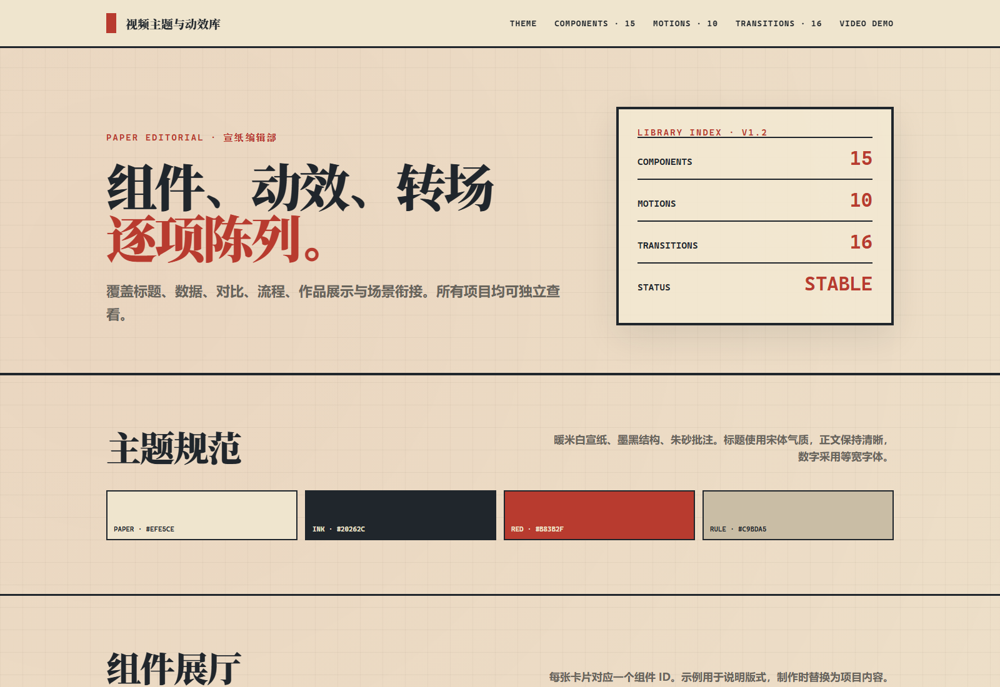

# Video Theme Library

[中文](#中文) · [English](#english)

一套可复用的 HyperFrames 视频视觉系统，包含 4 套稳定主题、主题组件、元素动效、基础转场和 GPU 旗舰转场。它既可以作为 Agent 的视觉规范，也可以直接把 CSS 与 JavaScript 模块复制进 HyperFrames 项目。



## 中文

### 现有主题

| ID | 中文名 | 适合内容 |
| --- | --- | --- |
| `paper-editorial` | 宣纸编辑部 | 技术解析、评测、对比、时间线与证据型内容 |
| `modern-minimal` | 现代秩序 | 产品发布、界面演示、企业内容与简洁数据故事 |
| `voxel-harness` | 方块终端 | 游戏插件、模组、开发工具与构建演示 |
| `signal-desk` | 信号台 | AI/科技快讯、产品更新、政策与行业事件 |

主展厅在 `index.html`。其余主题展厅位于 `showrooms/`；`timeline-demo/` 是一段独立的 HyperFrames 时间轴组合示例。

### 给 Agent 使用

把仓库克隆到 Codex skills 目录：

```powershell
git clone https://github.com/OBdangshang07/video-theme-library.git "$env:USERPROFILE\.codex\skills\video-theme-library"
```

然后在任务里直接指定主题和叙事用途：

```text
使用 $video-theme-library 的 modern-minimal 主题制作 HyperFrames 教程。
用 artifact-frame 承载录屏，paper-push 作为主转场，章节切换使用 chapter-bridge。
先读取 SKILL.md 和对应主题文档，不要照搬展厅文案。
```

其他 Agent 也可以使用本库：让它先读取根目录 `SKILL.md` 和 `references/catalog.md`，再读取所选主题文件。主题只定义视觉语言，不替代脚本和故事结构。

### 手动接入 HyperFrames

1. 从 `themes/<theme-id>/` 复制主题文件到视频项目的本地目录。
2. 在合成页面引入 `tokens.css` 与 `components.css`。
3. 按需导入 `motions.js`、`transitions.js`；不要一次使用整套动效。
4. 使用 `theme.json` 中登记的准确 ID，并遵守 `references/usage-contract.md`。
5. 渲染前冻结外部媒体，并运行项目自己的 HyperFrames 检查。

推荐每个场景只组合 2–4 个动效家族；全片选一个主转场，再保留一到两个强调转场。GPU 转场只用于少量关键交接。

### 本地检查

需要 Node.js 20 或更高版本。

```powershell
npm install
npx playwright install chromium
npm run validate:catalog
npm run verify:showrooms
npm run check
```

`npm run check` 使用固定的 HyperFrames 0.8.16 检查 `timeline-demo`。目录注册规则由 `scripts/validate-catalog.mjs` 验证。

### 目录

```text
themes/        四套主题的 tokens、组件、动效和转场
references/    Agent 入口、主题说明与使用边界
showrooms/     可滚动主题展厅
snapshots/     视觉回归参考图
timeline-demo/ HyperFrames 时间轴示例
scripts/       目录和展厅验证脚本
```

### 许可证

- 代码使用 MIT License。
- 原创设计、文档与预览素材使用 CC BY 4.0。
- 第三方字体和素材继续服从各自许可证，详见 `THIRD_PARTY_NOTICES.md`。
- `voxel-harness` 使用 Pixelify Sans；字体文件与 SIL OFL 1.1 许可证一同收录。

## English

Video Theme Library is a reusable visual system for HyperFrames. It ships four stable themes plus layout components, seek-safe motion presets, base transitions, and a small set of GPU flagship transitions.

### Use it with an agent

Clone the repository into your Codex skills directory, or ask any coding agent to read `SKILL.md`, `references/catalog.md`, and the selected theme reference before editing a HyperFrames project.

```text
Use the modern-minimal theme from $video-theme-library.
Place screen recordings in artifact-frame, use paper-push for ordinary cuts,
and reserve chapter-bridge for section changes. Do not reuse showroom copy.
```

Themes define visual language, not story structure. Use exact catalog IDs, combine only a few motion families per scene, and keep advanced GPU transitions for key handoffs.

### Development

```bash
npm install
npx playwright install chromium
npm run validate:catalog
npm run verify:showrooms
npm run check
```

See `CONTRIBUTING.md` for contribution rules and `THIRD_PARTY_NOTICES.md` for third-party licenses.

## Release

Current library release: `v4.0.0`.
